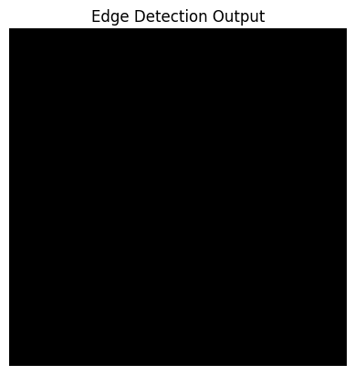

# Exp3-Sobel-edge-detection-filter-using-CUDA-to-enhance-the-performance-of-image-processing-tasks.

<h1> <align=center> Sobel edge detection filter using CUDA </h3>
  Implement Sobel edge detection filtern using GPU.</h3>
Experiment Details:

<h3>NAME: SETHUKKARASI C</h3>
<h3>REGISTER NUMBER: 212223230201</h3>
<h3>EX. NO:3</h3>
  
## AIM:
  The Sobel operator is a popular edge detection method that computes the gradient of the image intensity at each pixel. It uses convolution with two kernels to determine the gradient in both the x and y directions. This lab focuses on utilizing CUDA to parallelize the Sobel filter implementation for efficient processing of images.

## Code Overview: 
You will work with the provided CUDA implementation of the Sobel edge detection filter. The code reads an input image, applies the Sobel filter in parallel on the GPU, and writes the result to an output image.
## EQUIPMENTS REQUIRED:
Hardware – PCs with NVIDIA GPU & CUDA NVCC
Google Colab with NVCC Compiler
CUDA Toolkit and OpenCV installed.
A sample image for testing.

## PROCEDURE:
Tasks: 
a. Modify the Kernel:

Update the kernel to handle color images by converting them to grayscale before applying the Sobel filter.
Implement boundary checks to avoid reading out of bounds for pixels on the image edges.

b. Performance Analysis:

Measure the performance (execution time) of the Sobel filter with different image sizes (e.g., 256x256, 512x512, 1024x1024).
Analyze how the block size (e.g., 8x8, 16x16, 32x32) affects the execution time and output quality.

c. Comparison:

Compare the output of your CUDA Sobel filter with a CPU-based Sobel filter implemented using OpenCV.
Discuss the differences in execution time and output quality.

## PROGRAM:
```
%%writefile sobelEdgeDetectionFilter.cu
#include <stdio.h>
#include <stdlib.h>
#include <math.h>
#include <cuda.h>
#include <cuda_runtime.h>
#include <opencv2/opencv.hpp>
#include <opencv2/imgproc.hpp>

using namespace cv;

__global__ void sobelFilter(unsigned char *srcImage, unsigned char *dstImage, unsigned int width, unsigned int height) {
  int x = blockIdx.x * blockDim.x + threadIdx.x;
  int y = blockIdx.y * blockDim.y + threadIdx.y;
  if (x >= 1 && x < width - 1 && y >= 1 && y < height - 1) {
    int Gx[3][3] = {{-1, 0, 1}, {-2, 0, 2}, {-1, 0, 1}};
    int Gy[3][3] = {{1, 2, 1}, {0, 0, 0}, {-1, -2, -1}};

    int sumX = 0;
    int sumY = 0;

    for (int i = -1; i <= 1; i++) {
        for (int j = -1; j <= 1; j++) {
            unsigned char pixel = srcImage[(y + i) * width + (x + j)];
            sumX += pixel * Gx[i + 1][j + 1];
            sumY += pixel * Gy[i + 1][j + 1];
        }
    }

    int magnitude = sqrtf(sumX * sumX + sumY * sumY);
    magnitude = min(max(magnitude, 0), 255);
    dstImage[y * width + x] = static_cast<unsigned char>(magnitude);
  }
}

void checkCudaErrors(cudaError_t r) {
    if (r != cudaSuccess) {
        fprintf(stderr, "CUDA Error: %s\n", cudaGetErrorString(r));
        exit(EXIT_FAILURE);
    }
}

int main() {
    // Read input image
    Mat image = imread("/content/images.jpg", IMREAD_COLOR);

    if (image.empty()) {
        printf("Error: Image not found.\n");
        return -1;
    }

    int width = image.cols;
    int height = image.rows;
    size_t imageSize = width * height * sizeof(unsigned char);

    // Allocate host memory for output image
    unsigned char *h_outputImage = (unsigned char *)malloc(imageSize);
    if (h_outputImage == nullptr) {
        fprintf(stderr, "Failed to allocate host memory\n");
        return -1;
    }

    // Allocate device memory
    unsigned char *d_inputImage, *d_outputImage;
    checkCudaErrors(cudaMalloc(&d_inputImage, imageSize));
    checkCudaErrors(cudaMalloc(&d_outputImage, imageSize));
    checkCudaErrors(cudaMemcpy(d_inputImage, image.data, imageSize, cudaMemcpyHostToDevice));

    // Define CUDA events for timing
    cudaEvent_t start, stop;
    cudaEventCreate(&start);
    cudaEventCreate(&stop);

    // Launch kernel
    dim3 blockSize(16, 16);
    dim3 gridSize(ceil(width / 16.0), ceil(height / 16.0));

    cudaEventRecord(start);
    sobelFilter<<<gridSize, blockSize>>>(d_inputImage, d_outputImage, width, height);
    cudaEventRecord(stop);

    // Synchronize events
    cudaEventSynchronize(stop);

    // Calculate elapsed time
    float milliseconds = 0;
    cudaEventElapsedTime(&milliseconds, start, stop);

    // Copy result back to host
    checkCudaErrors(cudaMemcpy(h_outputImage, d_outputImage, imageSize, cudaMemcpyDeviceToHost));

    // Write output image
    Mat outputImage(height, width, CV_8UC1, h_outputImage);
    imwrite("output_sobel.jpeg", outputImage);

    // Free memory
    free(h_outputImage);
    cudaFree(d_inputImage);
    cudaFree(d_outputImage);

    // Destroy CUDA events
    cudaEventDestroy(start);
    cudaEventDestroy(stop);

    // Print elapsed time
    printf("Total time taken: %f milliseconds\n", milliseconds);

    return 0;
}
```

## OUTPUT:




## RESULT:
Thus the program has been executed by using CUDA in 12.014432 milliseconds.
